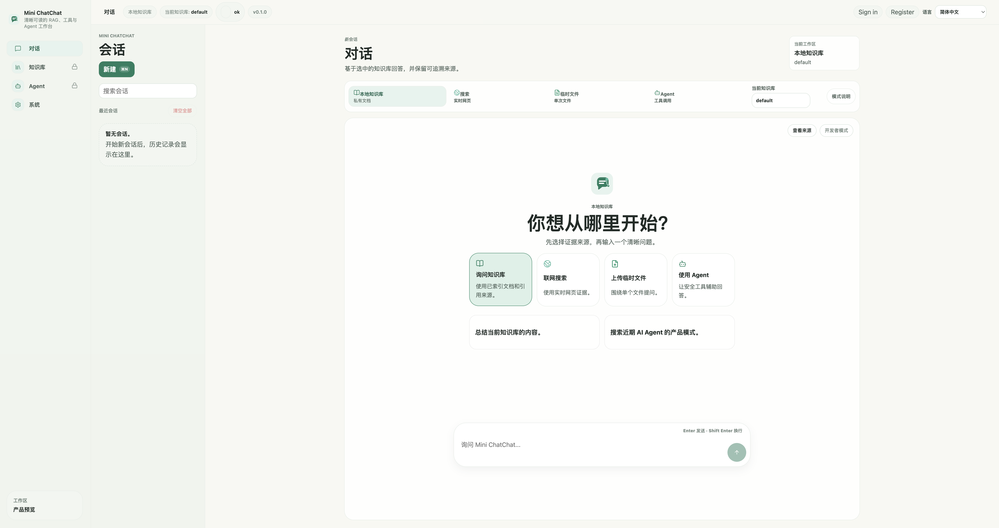
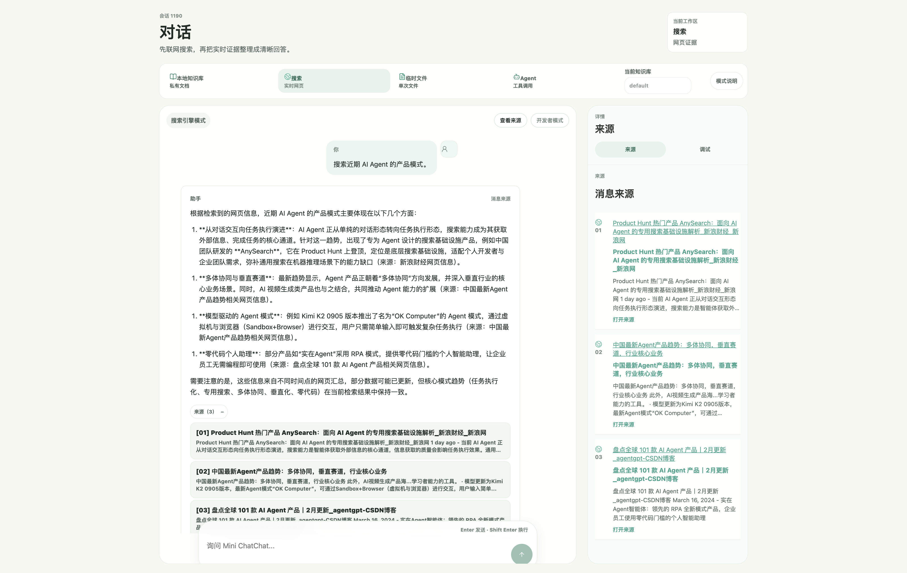
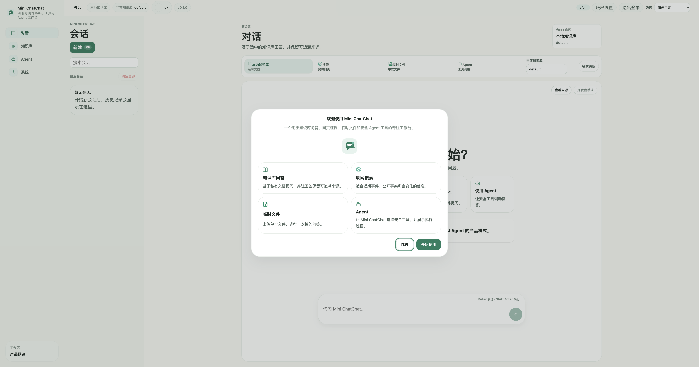
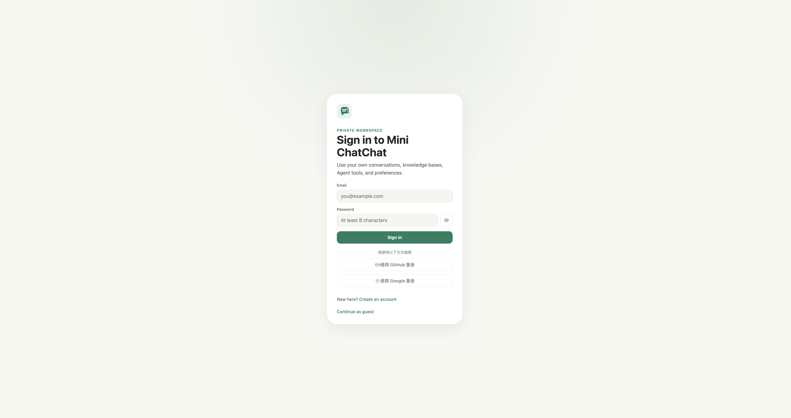
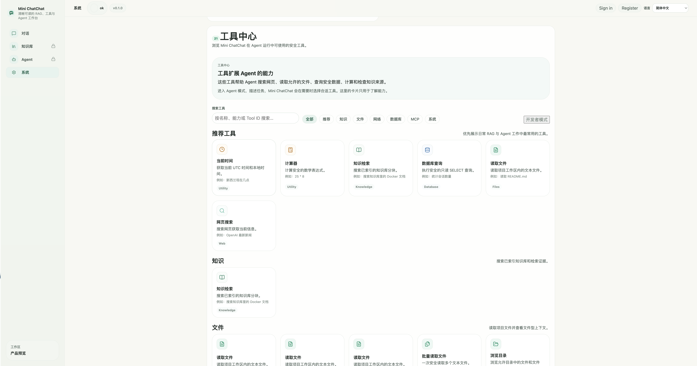
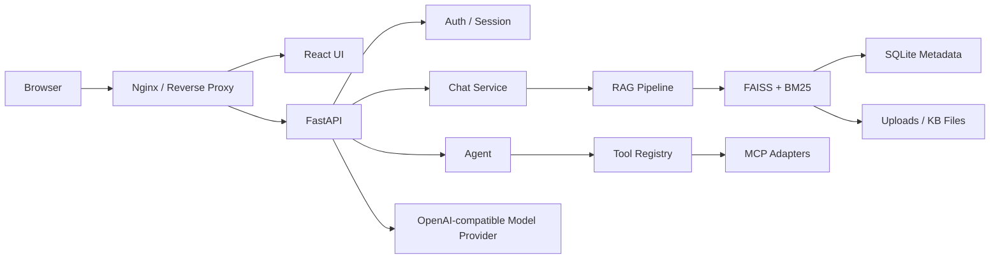

# Mini ChatChat

[English](README.md) | [简体中文](README.zh-CN.md)

Mini ChatChat is a full-stack AI knowledge workspace built with FastAPI, React, FAISS, SQLite, and OpenAI-compatible model providers.




## Demo Video

Watch the full product walkthrough:

<!-- GitHub README links to the local demo recording. Upload it to YouTube, Bilibili, or a GitHub Release later if a more stable external player is preferred. -->
[](docs/release/media/github-readme/mini-chatchat-demo.mov)

The demo covers:

- Email registration and login
- Local knowledge-base chat
- Web search
- Temporary file chat
- Source inspection
- Agent tool calling
- Tool Center
- Account and session management
- Docker production architecture

## Project Highlights

Mini ChatChat focuses on product-grade full-stack AI engineering rather than hiding the core flow behind a framework.

- Inspectable retrieval-augmented generation (RAG) pipeline without LangChain
- FAISS + BM25 hybrid search, metadata filters, rerank, deduplication, and token budget
- Streaming answers with source persistence, conversation history, and feedback
- Local knowledge base, web search, and temporary file chat modes
- Agent planner, Tool Registry, readonly MCP tools, and tool trace restore
- Email auth, HttpOnly refresh cookie, session management, OAuth infrastructure, and user isolation
- React + TypeScript product UI with design system, onboarding, bilingual interface, and account pages
- Docker Compose, nginx proxy, health checks, backup/restore scripts, and deployment docs
- 30/30 smoke tests covering RAG, auth, Agent, MCP, tools, and deployment-critical APIs

## Core Features

Mini ChatChat includes the core workflows expected from a ChatChat-style AI knowledge workspace.

- **Chat modes**: local KB, web search, temp file chat, and Agent mode
- **Knowledge base**: upload, document list, reindex, delete, import, export, and source inspection
- **Retrieval**: FAISS vector search, BM25 lexical search, hybrid ranking, metadata filter, rerank, deduplication, and context budget
- **Conversations**: history, rename, delete, updated time, feedback, and assistant source metadata
- **Agent**: one-shot and multi-step tool use, planner metadata, Tool Registry, browser search/read, filesystem readonly, SQLite readonly, and MCP adapter paths
- **Authentication**: email registration/login, refresh rotation, session list, logout other devices, account profile, Google/GitHub OAuth infrastructure, and user data isolation
- **System**: health checks, provider/model summary, dependency checks, tool catalog, MCP status, and runtime version
- **Deployment**: Docker dev/prod compose, nginx reverse proxy, production env examples, backup/restore, and release candidate docs

### Product Showcase


The main workspace keeps Chat as the primary surface while exposing local KB, search, temp file, and Agent modes.



Search answers can show source cards with URLs, snippets, and inspection details.



The onboarding flow explains the available modes without exposing developer-only controls first.



The authentication flow supports email login and OAuth entry points while keeping Guest mode available.



The System workspace includes a product-style Tool Center for safe Agent capabilities.

## Architecture

The app runs as a React frontend behind nginx and a FastAPI backend that owns auth, chat orchestration, retrieval, agents, storage, and model calls.



Key backend modules:

- `backend/app.py`: FastAPI routes and request models
- `backend/chat_service.py`: local KB, temp KB, search, streaming, conversation persistence
- `backend/rag.py`: splitting, prompt context, token budget, answer generation
- `backend/db.py`: SQLite schema, migrations, users, sessions, conversations, KB metadata
- `backend/auth/`: password hashing, JSON Web Token (JWT), refresh sessions, OAuth, permissions
- `backend/user_scope.py`: user-scoped database and file paths
- `backend/services/kb_service.py`: FAISS persistence, hybrid search, metadata filters, deduplication
- `backend/services/tools/`: local safe tools
- `backend/services/mcp_registry.py`: MCP tool discovery and adapters

## Tech Stack

Mini ChatChat uses a small stack that is readable enough for interviews and complete enough for product demos.

| Layer | Tools |
| --- | --- |
| Frontend | React, TypeScript, Vite, Lucide, Vitest, Nginx |
| Backend | FastAPI, Python, SQLite, FAISS, Sentence Transformers |
| AI | DeepSeek, OpenAI-compatible API, hybrid search, Agent tool calling, MCP |
| Engineering | Docker, Docker Compose, nginx, smoke tests, ESLint, typecheck, backup/restore |

## RAG Pipeline

The retrieval path stays explicit so each step can be inspected, tested, and discussed.

```text
Question -> Retrieve -> Filter -> Rerank -> Deduplicate -> Budget -> Prompt -> LLM -> Answer
```

Implemented retrieval behavior:

- Document parsing for `.txt`, `.pdf`, `.docx`, `.md`, and `.csv`
- Chunking with stored file metadata
- FAISS vector search
- BM25 lexical search
- Hybrid score merging
- Optional metadata filtering by file/source
- Lightweight embedding rerank
- Duplicate chunk removal
- Prompt context token budget
- Return-direct retrieval mode for debugging without calling the model

## Agent / Tools / MCP

Agent mode demonstrates tool-using AI without turning the project into an unsafe automation sandbox.

- Tool Registry with structured specs and results
- Safe tools: calculator, current time, KB search, browser search/read, filesystem readonly, SQLite readonly
- Agent planner and multi-step loop with trace restore
- MCP adapter foundation with allowlisted readonly integration paths
- Developer Mode for tool IDs, schemas, payloads, and trace details

The current MCP integration is intentionally controlled. Filesystem and SQLite access are readonly and scoped.

## Authentication & Security

Authentication is implemented as part of the product, not as a mock layer.

- Email registration and login
- Password hashing, never plaintext password storage
- Short-lived access token
- HttpOnly refresh cookie with refresh rotation
- Session list, revoke session, logout other devices, and logout all devices
- User-scoped conversations, KBs, files, sessions, and preferences
- Google/GitHub OAuth infrastructure and account linking
- Origin checks, CORS configuration, rate limits, and production secret checks

Google and GitHub OAuth flows are implemented, but real provider end-to-end verification requires valid production credentials and callback configuration.

## Knowledge Base Workflow

The Knowledge workspace supports the core document lifecycle for local RAG demos.

1. Create or select a knowledge base
2. Upload supported document files
3. Inspect file status, chunk counts, and indexing metadata
4. Ask local KB questions in chat
5. Open answer sources and inspect retrieved chunks
6. Reindex, delete, import, or export KB data


## Testing & Quality

The project uses deterministic checks and smoke tests before claims of completion.

Frontend:

```bash
cd frontend-react
npm run typecheck
npm run lint
npm run test
npm run build
```

Backend syntax check:

```bash
python3 -m py_compile backend/app.py backend/db.py backend/chat_service.py backend/rag.py
```

Smoke suite:

```bash
python3 scripts/run_smoke_tests.py
```

Current release candidate evidence:

- Typecheck, lint, Vitest, and production build passed
- Backend compile passed for release-touched modules
- Smoke runner passed 30/30 tests
- Docker dev/prod builds passed
- Browser QA captured desktop, tablet, and mobile screenshots
- `npm audit` and `npm audit --omit=dev` reported 0 vulnerabilities in the React project

## Docker & Deployment

Mini ChatChat supports local development, Docker private deployment, and controlled demo deployment. A public hosted demo is not currently available.

Development compose:

```bash
cp .env.example .env.docker
docker compose -f docker-compose.dev.yml up --build
```

Production compose:

```bash
cp .env.production.example .env.production
mkdir -p runtime/prod
docker compose -f docker-compose.prod.yml up --build -d
```

Production endpoints:

```text
Frontend: http://127.0.0.1/
Backend:  http://127.0.0.1/api
```

Health checks:

```bash
curl http://127.0.0.1/healthz
curl http://127.0.0.1/api/health
curl http://127.0.0.1/api/health/deps
```

Backup and restore:

```bash
scripts/backup.sh
RESTORE_CONFIRM=yes scripts/restore.sh backups/mini-chatchat-YYYYMMDDTHHMMSSZ.tar.gz
```

## Quick Start

Use the local path for development and Docker for a private demo.

### Local backend

```bash
python3 -m venv .venv
source .venv/bin/activate
python3 -m pip install -r requirements.txt
cd backend
uvicorn app:app --reload --host 127.0.0.1 --port 8000
```

Backend URL:

```text
http://127.0.0.1:8000
```

### Local React frontend

```bash
cd frontend-react
npm install
npm run dev -- --host 127.0.0.1 --port 5173
```

Frontend URL:

```text
http://127.0.0.1:5173
```

### Docker private demo

```bash
cp .env.production.example .env.production
mkdir -p runtime/prod
docker compose -f docker-compose.prod.yml up --build -d
curl http://127.0.0.1/api/health
```

## Environment Variables

Do not commit real secrets. Use `.env.example`, `.env.production.example`, and [environment variable docs](docs/deployment/environment-variables.md) as the source of truth.

| Variable | Purpose |
| --- | --- |
| `DEEPSEEK_API_KEY` | DeepSeek API key |
| `OPENAI_API_KEY` | OpenAI-compatible fallback key |
| `JWT_SECRET_KEY` | JWT signing secret |
| `ALLOWED_ORIGINS` | Browser origins allowed by CORS and auth origin checks |
| `FRONTEND_URL` | Frontend URL used by auth and OAuth flows |
| `AUTH_COOKIE_SECURE` | Secure cookie flag for refresh sessions |
| `GOOGLE_CLIENT_ID` | Google OAuth client ID |
| `GOOGLE_CLIENT_SECRET` | Google OAuth client secret |
| `GITHUB_CLIENT_ID` | GitHub OAuth client ID |
| `GITHUB_CLIENT_SECRET` | GitHub OAuth client secret |
| `DATA_DIR` | Knowledge-base data root |
| `UPLOAD_DIR` | Upload storage path |
| `DATABASE_PATH` | SQLite database path |

## Demo Walkthrough

Use the scripted walkthrough for a 5 to 8 minute portfolio or interview demo:

- [English demo script](docs/release/demo-script.md)
- [Chinese demo script](docs/release/demo-script.zh-CN.md)

Recommended flow:

1. Explain the product goal
2. Show Guest mode and locked capabilities
3. Register or log in with a demo account
4. Complete onboarding
5. Create a KB and upload a document
6. Ask a local KB question and inspect sources
7. Switch to web search
8. Upload a temp file and ask a question
9. Run Agent tool calling
10. Show Tool Center, Account/Sessions, System, and Docker architecture

## Project Structure

The repository separates backend services, React UI, docs, scripts, and runtime data.

```text
backend/          FastAPI app, auth, RAG, DB, services, tools, MCP adapters
frontend-react/   React + TypeScript product UI
frontend/         Legacy plain HTML/CSS/JS frontend
scripts/          Smoke tests, backup, restore
docs/             Architecture, roadmap, deployment, refactor, release docs
runtime/          Local production runtime data, ignored by Git
backups/          Local backup archives, ignored by Git
```

## Current Status

Mini ChatChat is portfolio-ready and suitable for local or Docker-based private demos.

The current release candidate includes production containerization, email authentication, session management, user data isolation, RAG, Agent tools, MCP integration, and automated smoke tests.

A public hosted demo is not currently available.

Google and GitHub OAuth flows are implemented, but real provider end-to-end verification requires valid production credentials and callback configuration.

## Known Limitations

The current release candidate is a strong portfolio demo, not a horizontally scaled SaaS platform.

- No public hosted demo
- Single-node SQLite architecture
- Backend image is about 2 GB
- Real Google/GitHub OAuth provider end-to-end verification still requires credentials
- No email verification
- No password reset
- No distributed rate limiting
- Backup is local archive only
- No encrypted off-site backup
- Public production deployment still requires HTTPS, monitoring, and shared infrastructure

## Roadmap

The next work should focus on deployment hardening rather than more demo features.

- Public staging deployment
- Real OAuth provider verification
- Email verification
- Password reset
- Redis-backed rate limiting
- PostgreSQL migration
- Encrypted off-site backup
- CI security scanning
- Optional Optical Character Recognition (OCR), PPT, and Excel loaders
- Controlled browser agent tools

## Documentation

Project docs are organized by design, refactor history, deployment, and release readiness.

- [UI Design Bible](docs/ui-design/01-design-bible.md)
- [Design tokens](docs/ui-design/02-design-tokens.md)
- [Component library](docs/ui-design/05-component-library.md)
- [Refactor records](docs/refactor/phase-1-foundation.md)
- [Deployment docs](docs/deployment/production-deployment.md)
- [Environment variables](docs/deployment/environment-variables.md)
- [Backup and restore](docs/deployment/backup-restore.md)
- [OAuth provider setup](docs/deployment/oauth-provider-setup.md)
- [Production checklist](docs/deployment/production-checklist.md)
- [Architecture notes](docs/release/architecture.md)
- [Security review](docs/release/dependency-security-review.md)
- [Release candidate readiness](docs/release/v1.0-release-candidate-readiness.md)
- [Runtime verification](docs/release/v1.0-runtime-verification.md)
- [English demo script](docs/release/demo-script.md)
- [Chinese demo script](docs/release/demo-script.zh-CN.md)

## License

No open-source license has been selected yet. Until a license file is added, the project is visible for portfolio review but not licensed for reuse, redistribution, or commercial use.
