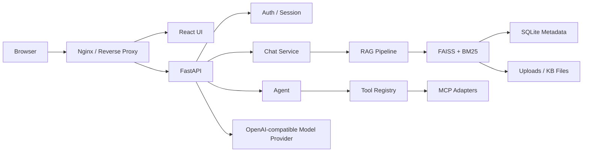

# Mini ChatChat

[English](README.md) | [简体中文](README.zh-CN.md)

Mini ChatChat 是一个基于 FastAPI、React、FAISS、SQLite 和 OpenAI-compatible 模型服务构建的全栈 AI 知识工作台。


## 演示视频

观看完整产品演示：

<!-- README 目前链接到仓库内的本地录屏；如果后续需要更稳定的在线播放体验，可以上传到 YouTube、Bilibili 或 GitHub Release 后替换链接。 -->
[](docs/release/media/github-readme/mini-chatchat-demo.mov)

演示内容包括：

- 邮箱注册与登录
- 本地知识库问答
- 联网搜索
- 临时文件问答
- 来源查看
- Agent 工具调用
- Tool Center
- 账户与 Session 管理
- Docker 生产架构

## 项目亮点

Mini ChatChat 更关注完整的全栈 AI 产品工程，而不是把核心链路全部隐藏在框架后面。

- 不依赖 LangChain 的可读 RAG 主链路
- FAISS + BM25 Hybrid Search、元数据过滤、rerank、去重和上下文 token 预算
- 流式回答、来源持久化、会话历史和反馈
- 本地知识库、联网搜索和临时文件问答
- Agent planner、Tool Registry、只读 MCP 工具和工具 trace 恢复
- 邮箱认证、HttpOnly refresh cookie、Session 管理、OAuth 基础设施和用户数据隔离
- React + TypeScript 产品界面、设计系统、Onboarding、双语界面和账户页面
- Docker Compose、nginx 代理、健康检查、备份/恢复脚本和部署文档
- 30/30 Smoke Tests，覆盖 RAG、认证、Agent、MCP、工具和部署关键 API

## 核心功能

Mini ChatChat 覆盖了 ChatChat 风格 AI 知识工作台的核心工作流。

- **聊天模式**：本地知识库、联网搜索、临时文件问答和 Agent 模式
- **知识库**：上传、文档列表、重建索引、删除、导入、导出和来源查看
- **检索**：FAISS 向量检索、BM25 关键词检索、混合排序、元数据过滤、rerank、去重和上下文预算
- **会话**：历史记录、重命名、删除、更新时间、反馈和 assistant 来源 metadata
- **Agent**：单步与多步工具调用、planner metadata、Tool Registry、网页搜索/读取、文件只读、SQLite 只读和 MCP adapter 路径
- **认证**：邮箱注册/登录、refresh rotation、Session 列表、退出其他设备、账户资料、Google/GitHub OAuth 基础设施和用户数据隔离
- **系统**：健康检查、provider/model 摘要、依赖检查、工具目录、MCP 状态和运行版本
- **部署**：Docker dev/prod compose、nginx 反向代理、生产环境变量示例、备份/恢复和发布候选文档

### 产品展示


主工作区以 Chat 为核心，同时提供本地知识库、联网搜索、临时文件和 Agent 模式。


搜索回答可以展示网页来源、摘要和来源检查信息。


Onboarding 先解释普通用户能理解的模式，不把开发者信息放在第一层。


认证流程支持邮箱登录和 OAuth 入口，同时保留 Guest 模式。


System 工作区包含产品化的 Tool Center，用于展示安全 Agent 能力。

## 架构

应用由 nginx 后的 React 前端和 FastAPI 后端组成。后端负责认证、聊天编排、检索、Agent、存储和模型调用。



关键后端模块：

- `backend/app.py`：FastAPI 路由和请求模型
- `backend/chat_service.py`：本地 KB、临时 KB、搜索、流式响应和会话持久化
- `backend/rag.py`：切分、prompt context、token 预算和回答生成
- `backend/db.py`：SQLite schema、迁移、用户、Session、会话和 KB metadata
- `backend/auth/`：密码哈希、JSON Web Token (JWT)、refresh session、OAuth 和权限
- `backend/user_scope.py`：用户隔离的数据和文件路径
- `backend/services/kb_service.py`：FAISS 持久化、混合检索、元数据过滤和去重
- `backend/services/tools/`：本地安全工具
- `backend/services/mcp_registry.py`：MCP 工具发现和 adapter

## 技术栈

Mini ChatChat 的技术选型尽量保持可读性，同时覆盖完整产品演示所需能力。

| 层级 | 技术 |
| --- | --- |
| Frontend | React, TypeScript, Vite, Lucide, Vitest, Nginx |
| Backend | FastAPI, Python, SQLite, FAISS, Sentence Transformers |
| AI | DeepSeek, OpenAI-compatible API, hybrid search, Agent tool calling, MCP |
| Engineering | Docker, Docker Compose, nginx, smoke tests, ESLint, typecheck, backup/restore |

## RAG Pipeline

检索链路保持显式实现，方便检查、测试和面试讲解。

```text
Question -> Retrieve -> Filter -> Rerank -> Deduplicate -> Budget -> Prompt -> LLM -> Answer
```

已实现的检索能力：

- 支持 `.txt`、`.pdf`、`.docx`、`.md` 和 `.csv` 文档解析
- 文档切分和文件 metadata 存储
- FAISS 向量检索
- BM25 关键词检索
- Hybrid score 合并
- 可选按文件/source 过滤
- 轻量 embedding rerank
- 重复 chunk 去重
- Prompt context token 预算
- Return-direct 检索模式，可在不调用模型的情况下调试来源

## Agent / Tools / MCP

Agent 模式展示了工具调用能力，但不会把项目变成不受控的自动化沙箱。

- Tool Registry，包含结构化 spec 和 result
- 安全工具：计算器、当前时间、KB search、网页搜索/读取、文件只读、SQLite 只读
- Agent planner 和多步循环，支持 trace 恢复
- MCP adapter 基础设施，接入 allowlisted 的只读能力
- Developer Mode 展示工具 ID、schema、payload 和 trace 细节

当前 MCP 集成是受控设计。Filesystem 和 SQLite 访问都限制为只读并受 scope 限制。

## Authentication & Security

认证是真实产品链路的一部分，不是 mock 层。

- 邮箱注册和登录
- 密码哈希，禁止明文保存密码
- 短期 access token
- HttpOnly refresh cookie 和 refresh rotation
- Session 列表、撤销 Session、退出其他设备和退出全部设备
- 用户隔离的会话、知识库、文件、Session 和偏好
- Google/GitHub OAuth 基础设施和账号绑定
- Origin 校验、CORS 配置、限流和生产 secret 检查

Google 和 GitHub OAuth 主链路已经实现，但仍需要真实生产凭据和回调地址完成 Provider 端到端验证。

## Knowledge Base Workflow

Knowledge 工作区支持本地 RAG 演示所需的核心文档生命周期。

1. 创建或选择知识库
2. 上传支持的文档文件
3. 查看文件状态、chunk 数量和索引 metadata
4. 在聊天中发起本地 KB 问答
5. 打开回答来源并查看检索到的 chunk
6. 重建索引、删除、导入或导出 KB 数据


## Testing & Quality

项目用确定性检查和 Smoke Tests 支撑完成度声明。

前端：

```bash
cd frontend-react
npm run typecheck
npm run lint
npm run test
npm run build
```

后端语法检查：

```bash
python3 -m py_compile backend/app.py backend/db.py backend/chat_service.py backend/rag.py
```

Smoke suite：

```bash
python3 scripts/run_smoke_tests.py
```

当前发布候选版本证据：

- Typecheck、lint、Vitest 和生产构建已通过
- 发布相关后端模块 compile 已通过
- Smoke runner 通过 30/30
- Docker dev/prod build 已通过
- Browser QA 已生成桌面、平板和移动端截图
- React 项目 `npm audit` 和 `npm audit --omit=dev` 均为 0 vulnerabilities

## Docker & Deployment

Mini ChatChat 支持本地开发、Docker 私有部署和受控 Demo 部署。目前暂未提供公开在线 Demo。

开发 compose：

```bash
cp .env.example .env.docker
docker compose -f docker-compose.dev.yml up --build
```

生产 compose：

```bash
cp .env.production.example .env.production
mkdir -p runtime/prod
docker compose -f docker-compose.prod.yml up --build -d
```

生产端点：

```text
Frontend: http://127.0.0.1/
Backend:  http://127.0.0.1/api
```

健康检查：

```bash
curl http://127.0.0.1/healthz
curl http://127.0.0.1/api/health
curl http://127.0.0.1/api/health/deps
```

备份与恢复：

```bash
scripts/backup.sh
RESTORE_CONFIRM=yes scripts/restore.sh backups/mini-chatchat-YYYYMMDDTHHMMSSZ.tar.gz
```

## Quick Start

本地开发使用 local 命令，私有演示使用 Docker。

### Local backend

```bash
python3 -m venv .venv
source .venv/bin/activate
python3 -m pip install -r requirements.txt
cd backend
uvicorn app:app --reload --host 127.0.0.1 --port 8000
```

Backend URL：

```text
http://127.0.0.1:8000
```

### Local React frontend

```bash
cd frontend-react
npm install
npm run dev -- --host 127.0.0.1 --port 5173
```

Frontend URL：

```text
http://127.0.0.1:5173
```

### Docker private demo

```bash
cp .env.production.example .env.production
mkdir -p runtime/prod
docker compose -f docker-compose.prod.yml up --build -d
curl http://127.0.0.1/api/health
```

## Environment Variables

不要提交真实 secret。`.env.example`、`.env.production.example` 和 [环境变量文档](docs/deployment/environment-variables.md) 是配置说明的来源。

| 变量 | 用途 |
| --- | --- |
| `DEEPSEEK_API_KEY` | DeepSeek API key |
| `OPENAI_API_KEY` | OpenAI-compatible fallback key |
| `JWT_SECRET_KEY` | JWT 签名 secret |
| `ALLOWED_ORIGINS` | CORS 和认证 Origin 校验允许的浏览器来源 |
| `FRONTEND_URL` | 认证和 OAuth 流程使用的前端地址 |
| `AUTH_COOKIE_SECURE` | refresh session 的 Secure cookie 标记 |
| `GOOGLE_CLIENT_ID` | Google OAuth client ID |
| `GOOGLE_CLIENT_SECRET` | Google OAuth client secret |
| `GITHUB_CLIENT_ID` | GitHub OAuth client ID |
| `GITHUB_CLIENT_SECRET` | GitHub OAuth client secret |
| `DATA_DIR` | 知识库数据根目录 |
| `UPLOAD_DIR` | 上传文件存储路径 |
| `DATABASE_PATH` | SQLite 数据库路径 |

## Demo Walkthrough

使用脚本完成 5 到 8 分钟的作品集或面试演示：

- [英文演示脚本](docs/release/demo-script.md)
- [中文演示脚本](docs/release/demo-script.zh-CN.md)

推荐流程：

1. 说明项目定位
2. 展示 Guest 模式和受限能力
3. 注册或登录 demo 账户
4. 完成 Onboarding
5. 创建 KB 并上传文档
6. 发起本地 KB 问答并查看来源
7. 切换到联网搜索
8. 上传临时文件并提问
9. 运行 Agent 工具调用
10. 展示 Tool Center、Account/Sessions、System 和 Docker 架构

## Project Structure

仓库按后端服务、React UI、文档、脚本和运行数据组织。

```text
backend/          FastAPI app, auth, RAG, DB, services, tools, MCP adapters
frontend-react/   React + TypeScript product UI
frontend/         Legacy plain HTML/CSS/JS frontend
scripts/          Smoke tests, backup, restore
docs/             Architecture, roadmap, deployment, refactor, release docs
runtime/          Local production runtime data, ignored by Git
backups/          Local backup archives, ignored by Git
```

## Current Status

Mini ChatChat 已达到作品集展示标准，适合本地运行和基于 Docker 的私有演示。

当前发布候选版本已包含生产容器化、邮箱认证、Session 管理、用户数据隔离、RAG、Agent 工具、MCP 集成和自动化 Smoke Tests。

目前暂未提供公开在线 Demo。

Google 和 GitHub OAuth 主链路已经实现，但仍需要真实生产凭据和回调地址完成 Provider 端到端验证。

## Known Limitations

当前发布候选版本是完整度较高的作品集 Demo，不是可水平扩展的 SaaS 平台。

- 暂无公开在线 Demo
- 单节点 SQLite 架构
- Backend 镜像约 2 GB
- Google/GitHub OAuth Provider 端到端验证仍需要真实凭据
- 暂无邮箱验证
- 暂无密码重置
- 暂无分布式限流
- 备份仍是本地归档
- 暂无加密异地备份
- 公开生产部署仍需要 HTTPS、监控和共享基础设施

## Roadmap

后续优先做部署硬化，而不是继续堆 Demo 功能。

- Public staging deployment
- Real OAuth provider verification
- Email verification
- Password reset
- Redis-backed rate limiting
- PostgreSQL migration
- Encrypted off-site backup
- CI security scanning
- Optional Optical Character Recognition (OCR), PPT, and Excel loaders
- Controlled browser agent tools

## Documentation

项目文档按设计、重构记录、部署和发布准备组织。

- [UI Design Bible](docs/ui-design/01-design-bible.md)
- [Design tokens](docs/ui-design/02-design-tokens.md)
- [Component library](docs/ui-design/05-component-library.md)
- [Refactor records](docs/refactor/phase-1-foundation.md)
- [Deployment docs](docs/deployment/production-deployment.md)
- [Environment variables](docs/deployment/environment-variables.md)
- [Backup and restore](docs/deployment/backup-restore.md)
- [OAuth provider setup](docs/deployment/oauth-provider-setup.md)
- [Production checklist](docs/deployment/production-checklist.md)
- [Architecture notes](docs/release/architecture.md)
- [Security review](docs/release/dependency-security-review.md)
- [Release candidate readiness](docs/release/v1.0-release-candidate-readiness.md)
- [Runtime verification](docs/release/v1.0-runtime-verification.md)
- [English demo script](docs/release/demo-script.md)
- [Chinese demo script](docs/release/demo-script.zh-CN.md)

## License

当前尚未选择开源协议。在添加 license 文件之前，本项目可用于作品集展示，但未授权复用、再分发或商业使用。
