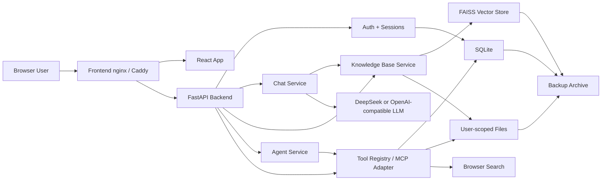

# Mini ChatChat v1.0 Architecture

## Runtime Boundaries

- React is served as static production assets.
- nginx proxies `/api` requests and keeps SSE buffering disabled.
- FastAPI owns auth, chat, RAG, Agent, tools, health, and import/export APIs.
- SQLite stores users, sessions, conversations, messages, KB metadata, OAuth links, and preferences.
- Runtime data is mounted under `runtime/prod` in production Compose.
- Backup and restore cover SQLite, user-scoped knowledge files, uploads, extracted content, and FAISS indexes.

## Security Boundaries

- Browser receives only short-lived access tokens.
- Refresh token is stored in an HttpOnly cookie.
- OAuth provider tokens are not persisted.
- Public health details are restricted in production unless explicitly enabled.
- Agent filesystem and SQLite tools are read-only and scoped.
